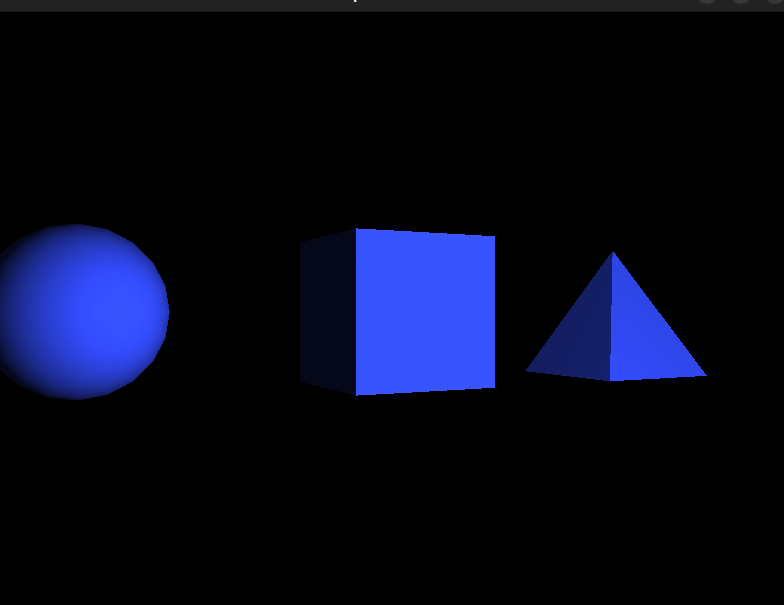

# Лабораторная работа 4: Освещение и работа с шейдерами
## **4 вариант**

## Цель лабораторной работы:

> В этой лабораторной работе вы научитесь работать с освещением в 3D-пространстве, используя различные типы источников света, и освоите основы написания шейдеров. Вы реализуете освещение объектов в сцене с использованием простейших моделей освещения и настроите эффекты при помощи вершинных и фрагментных шейдеров.

## Требования:
- Вы должны использовать OpenGL + SFML или OpenTK + C#.
- Программа должна корректно отображать освещение с учетом типов источников света, используя написанные вами шейдеры.
- В каждом варианте задания должны быть задействованы как минимум один тип освещения (например, направленное освещение, точечный источник света или прожектор).

## Вариант 4. Комбинация направленного и точечного освещения
- Постройте сцену с несколькими объектами (например, куб, сферу и пирамиду).
- Реализуйте направленный источник света и точечный источник света, которые одновременно влияют на все объекты сцены.
- Используйте вершинные и фрагментные шейдеры для расчета взаимодействия обоих источников света с объектами.
- Дополнительно: Реализуйте возможность динамически переключать типы источников света и изменять их параметры.

